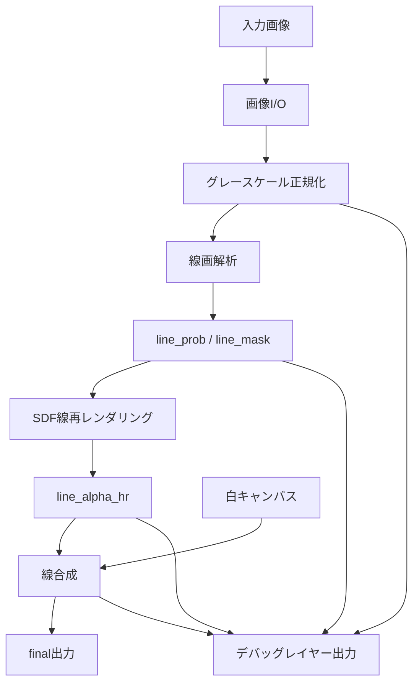

# 02. アーキテクチャ

## 1. 全体構成



白地黒線の純線画では `tone_source=white_canvas` と `upscaler=none` を使う。グレー階調やトーンを扱うプリセットでは、`tone_source` と `tone_hr` を生成してから線アルファを合成する。

## 2. モジュール責務

### `io.py`

- 入力画像の読み込み
- EXIF orientationの処理
- アルファチャンネルの保持
- 8bit/16bitの正規化
- PNG/TIFF保存
- MVPの既定出力は8bit PNG

### `grayscale.py`

- RGB/RGBAからグレースケールへの変換
- 既存グレースケール画像の正規化
- 背景白・線黒を前提にした濃度方向の確認
- 必要なら反転オプション
- RGBA入力はMVPでは白背景に合成して処理する

### `mask_extract.py`

- 線画マスク抽出
- グローバル閾値
- Sauvolaなどの局所閾値
- ヒステリシス閾値
- 小ノイズ除去
- 穴埋め
- line_prob生成
- line_mask生成

### `tone_source.py`

階調ブランチ用の拡張モジュール。

- 線領域を白側へ持ち上げる
- 局所背景推定
- インペイントまたは簡易置換
- 階調を壊さないための保護マスク作成

### `sdf_render.py`

- 二値マスクから内側距離・外側距離を計算
- Signed Distance Fieldを作る
- 高解像度へリサイズ
- 線幅補正
- アンチエイリアス付きline_alpha_hr生成

### `potrace_render.py`

任意の外部レンダラー連携。

- line_maskのPBM書き出し
- Potrace CLIでSVG生成
- CairoSVGまたはInkscape CLIで目標サイズPNGへラスタライズ
- PNGからline_alpha_hr生成
- Potrace/SVG/rasterizer実行情報の記録
- SDF参照line_alpha_hrのdebug生成

### `upscaler_external.py`

階調ブランチ用の外部・内部upscaler adapter。

- Real-CUGAN ncnn Vulkanの外部プロセス呼び出し
- waifu2x ncnn Vulkanの外部プロセス呼び出し
- Real-ESRGAN ncnn Vulkanの外部プロセス呼び出し
- 失敗時のエラーメッセージ整形
- subprocess stdout/stderrとfallback情報の記録
- tile-sizeなどのパラメータ管理
- Lanczosフォールバック

### `composite.py`

- MVPでは白キャンバスとline_alpha_hrの合成
- 後続フェーズではtone_hrとline_alpha_hrの合成
- 線の濃さ調整
- 線のエッジ濃度調整
- アルファチャンネル復元
- 出力レンジ調整

### `debug_layers.py`

- 中間画像保存
- パラメータJSON保存
- 低解像度と高解像度の比較画像生成
- 処理ログ保存

### `batch.py`

- 入力ディレクトリ探索
- バッチ出力パス生成
- 1ファイルごとの例外制御
- `summary.json` / `summary.csv` 保存

### `compare.py`

- パラメータグリッドYAMLの読み込み
- グリッド展開とvariantごとの設定マージ
- 複数出力PNG生成
- コンタクトシート生成
- 中央切り出しの等倍/200%比較画像生成
- `compare-summary.json` 保存

### `pipeline.py`

- 全体処理の接続
- 一時ディレクトリ管理
- 同名ファイル衝突回避

### `cli.py`

- コマンドライン引数
- 設定ファイル読み込み
- プリセット読み込み
- コマンド実行

## 3. データモデル

### `ImageData`

```text
path: Path | None
array: ndarray[float32]  # 0.0 white, 1.0 black ではなく、基本は 0.0 black, 1.0 white に統一する
alpha: ndarray[float32] | None
bit_depth: 8 | 16 | float
color_space_hint: str
metadata: dict
```

内部表現は「0.0=黒、1.0=白」を基本にする。線画抽出時は `darkness = 1.0 - gray` を使う。

### `LineMaps`

```text
line_prob: ndarray[float32]
line_mask: ndarray[bool]
line_soft: ndarray[float32]
background_mask: ndarray[bool]
```

### `RenderResult`

```text
canvas_or_tone_hr: ndarray[float32]
line_alpha_hr: ndarray[float32]
final: ndarray[float32]
debug_paths: list[Path]
```

純線画では `canvas_or_tone_hr` は白キャンバスを指す。グレー階調対応では `tone_hr` を入れる。

## 4. 処理単位

MVPでは単一画像を一括処理する。巨大画像対応は以下の順で対応する。

1. 外部アップスケーラー側のtile-size指定
2. Python側SDF計算は一括処理
3. 100MP超でメモリが厳しい場合のみ、タイル境界にオーバーラップを付ける

RAM 128GBなら、8000px四方程度のfloat32レイヤーを複数持つ処理は十分現実的だ。外部アップスケーラーを導入する後続フェーズでは、VRAMをtile-sizeで吸収する。

## 5. 外部バイナリの扱い

外部アップスケーラーは同梱しない。ユーザーの設定ファイルでパス指定する。

```yaml
external_tools:
  realcugan: "C:/tools/realcugan-ncnn-vulkan/realcugan-ncnn-vulkan.exe"
  waifu2x: "C:/tools/waifu2x-ncnn-vulkan/waifu2x-ncnn-vulkan.exe"
  realesrgan: "C:/tools/realesrgan-ncnn-vulkan/realesrgan-ncnn-vulkan.exe"
  potrace: "C:/tools/potrace/potrace.exe"
```

MVPの純線画処理では外部バイナリを必須にしない。階調ブランチの外部バイナリが未設定の場合は、設定に応じて内部リサイズへフォールバックする。Potraceレンダラーを明示した場合だけは、未設定時にfallbackせずエラーにする。

## 6. 例外設計

- 入力ファイルが読めない：即時終了
- 外部バイナリがない：明確な設定エラー、またはフォールバック
- 外部プロセス失敗：stderrをログに残す
- 出力サイズが大きすぎる：推定メモリを表示して停止できるようにする
- 線画抽出が空：警告を出して、MVPでは白画像を出力できるようにする。後続の階調対応ではtone_hrのみ出力できるようにする
- 線画抽出が全面：閾値設定ミスとして警告する

## 7. 再現性

各出力の隣に、実行時設定をJSONで保存する。

```text
output.png
output_debug/
```

通常処理では最終PNGだけを保存する。`debug.save_run_json: true`、CLIの `--save-run-json`、またはデバッグディレクトリを明示した場合は `output.mlus-run.json` も保存する。`mlus-run.json`には以下を保存する。

- 入力ファイルパス
- 入力画像サイズ
- 出力サイズ
- 使用プリセット
- 実効設定
- 外部アップスケーラーのコマンドライン
- 実行日時
- ツールバージョン
